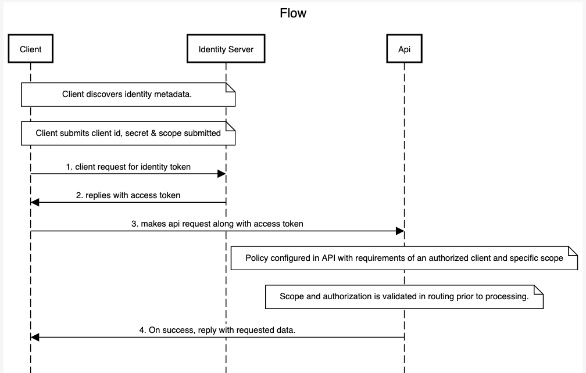

# Identity Server 4 Sample
Goal: To understand the fundamental mechanics

## Somethings to test:

    * try to connect to IdentityServer when it is not running (unavailable)
    * try to use an invalid client id or secret to request the token
    * try to ask for an invalid scope during the token request
    * try to call the API when it is not running (unavailable)
    * don’t send the token to the API
    * configure the API to require a different scope than the one in the token

## This consists of 3 Main entities:
1. Identity Server 
2. API (with a policy and scope applied)
3. Client 

## The interaction:

